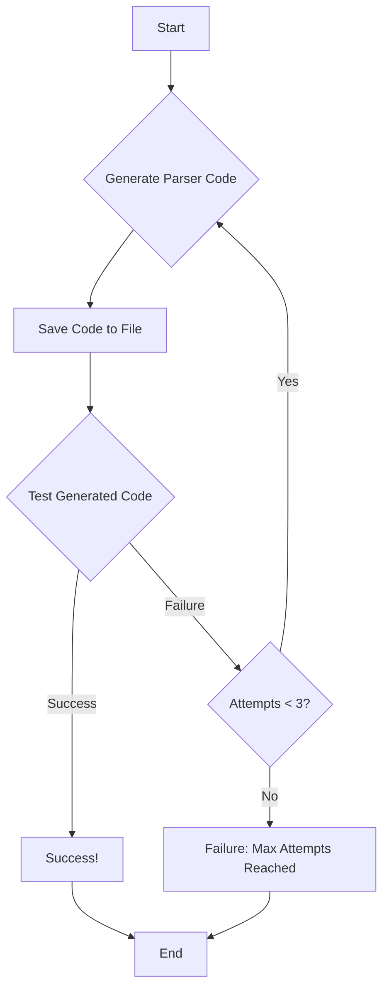

# AI Agent Challenge

This project is a coding challenge to write custom parsers for bank statement PDFs. The AI agent in this project is designed to automatically generate a parser for a given bank statement, test it, and save it for future use.

-----

## Getting Started

Follow these instructions to get the project set up and running on your local machine.

### Prerequisites

Make sure you have the following installed:

  * **Python** (version 3.6 or higher)
  * **Git**

-----

### Installation & Setup

1.  **Clone the repository** to your local machine:

    ```bash
    git clone https://github.com/your-username/ai-agent-challenge.git
    ```

2.  **Navigate to the project directory**:

    ```bash
    cd ai-agent-challenge
    ```

3.  **Install the required dependencies**. It is recommended to use a virtual environment:

    ```bash
    pip install -r requirements.txt
    ```

4.  **Add your API key**:

      * Create a file named `.env` in the root of the project.
      * Add the following line to the `.env` file, replacing `your_api_key_here` with your actual API key:
        ```
        API_KEY="your_api_key_here"
        ```

5.  **Run the agent** using the command line, specifying the target bank:

    ```bash
    python agent.py --target icici
    ```

-----

### Running the Agent

You can run the agent for any of the supported banks by changing the `--target` argument.

  * **To run the parser for ICICI Bank statements, use the following command**:
    ```bash
    python agent.py --target icici
    ```

-----

## How It Works

The agent follows a simple yet powerful workflow to generate, test, and refine the PDF parsers.



1.  **Generate Parser Code**: The agent starts by calling a generative AI model to create a Python function that can parse the provided bank statement PDF. It uses the PDF's text and the expected CSV output as context.
2.  **Save Code to File**: The generated Python code is saved to a file in the `custom_parsers` directory.
3.  **Test Generated Code**: The agent then executes the newly saved parser function and compares its output DataFrame to the expected `result.csv`.
4.  **Loop or End**:
      * If the output **matches** the expected result, the process ends successfully.
      * If the output **does not match**, the agent checks if it has tried less than 3 times.
          * If **yes**, it loops back to the beginning to generate a new, improved version of the code, this time including the previous error as context.
          * If **no**, the agent stops after 3 failed attempts.